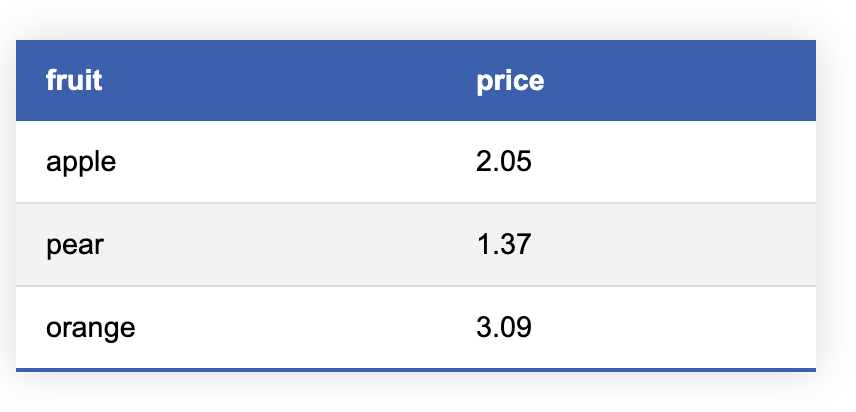

# Markdown Table to PNG converter

Useful for converting Markdown tables to PNGs for later import.

## Requirements

- [Headless](https://developer.chrome.com/blog/headless-chrome/) Chrome to function.
- [Pillow](https://python-pillow.org/) for image manipulation.
- [html2Image](https://github.com/vgalin/html2image) for image generation.
- [Markdown](https://python-markdown.github.io/) for Markdown parsing.

## Example Table

| fruit  | price  |
|--------|--------|
| apple  | 2.05   |
| pear   | 1.37   |
| orange | 3.09   |

Results:

